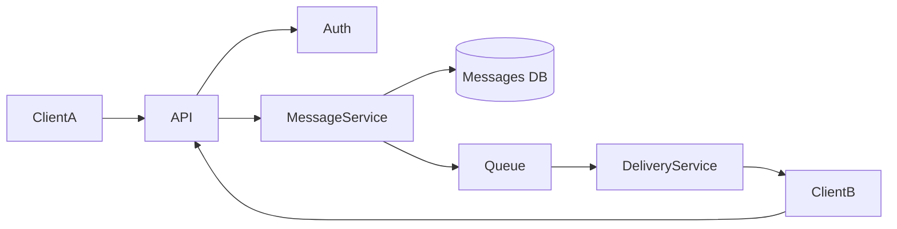
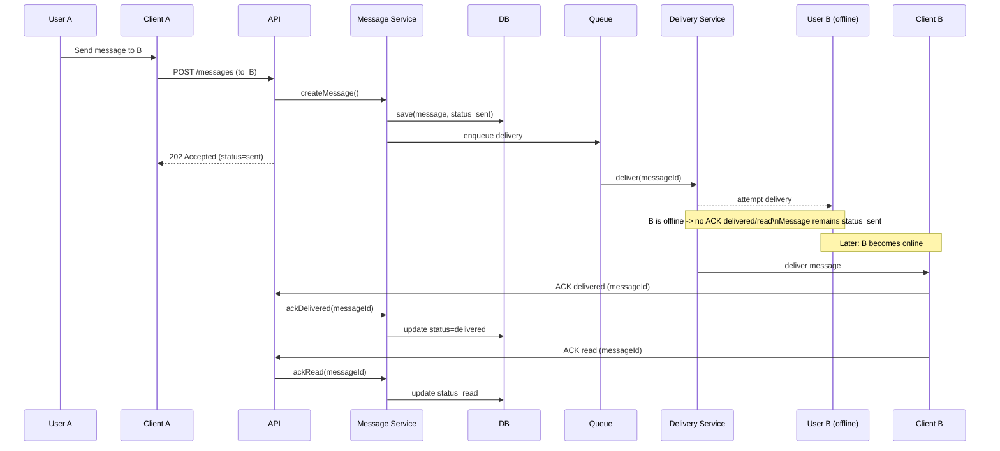
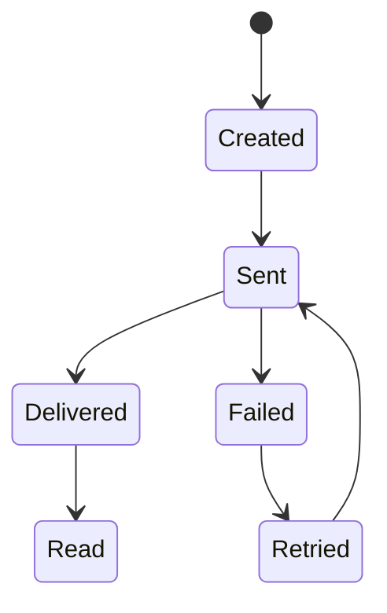

## 🧱 Part 1 — Component Diagram (30%)

### Component Diagram (Mermaid)



## 🔁 Part 2 — Sequence Diagram (25%)

### Scenario
User **A sends a message** to user **B who is offline**.  
The system supports message statuses **sent / delivered / read** via **client acknowledgements (ACK)**.

### Task
Describe the interaction sequence in time, including:
- storing the message and setting status **sent**;
- asynchronous delivery attempt;
- what happens when **ACK is missing** because user B is offline;
- later, when B becomes online, how **ACK delivered** and **ACK read** update statuses.


## 🔄 Part 3 — State Diagram (20%)

### Object
`Message`

### Task
Describe the **message lifecycle**.

## 📚 Part 4 — ADR (Architecture Decision Record) (25%)
### Task
Document one architecture decision (statuses + ACK ownership).
```markdown
# ADR-001: Update message statuses via client acknowledgements (ACK)

## Status
Accepted

## Context
The system must track message statuses: sent, delivered, read.
Recipients may be offline and delivery is asynchronous.
A server-side push does not guarantee that the recipient device actually received or displayed the message.

## Decision
Use client acknowledgements to update message statuses:
- Set status "sent" when Message Service persists the message in the database.
- Set status "delivered" only after the recipient client sends ACK(delivered).
- Set status "read" only after the recipient client sends ACK(read).
Message Service is the single authority that writes status changes to the database.

## Alternatives
- Mark delivered on server push only (rejected)
- Derive status via periodic client polling without ACK (considered)

## Consequences
+ Status semantics are accurate and based on confirmed client events
+ Works with offline users (ACK may arrive later)
+ Clear ownership: Message Service controls lifecycle and persistence
- Requires idempotent ACK endpoints (clients can resend ACK)
- Missing ACK means status can remain "sent" or "delivered" longer than the real-world event
- Adds extra requests and some implementation complexity
```
