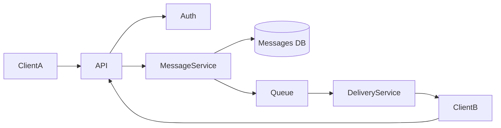
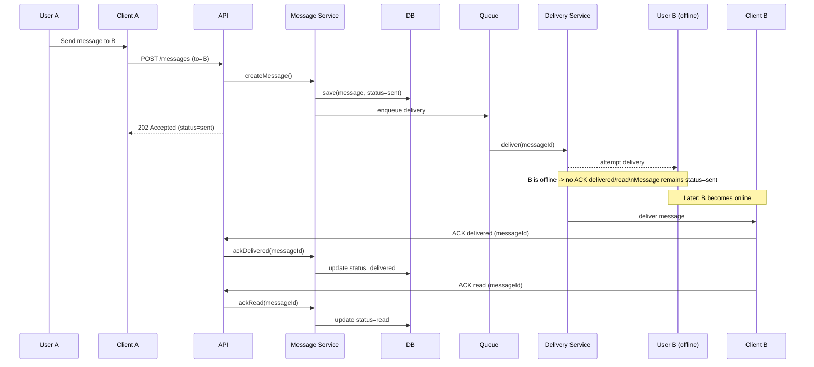

## 🧱 Part 1 — Component Diagram (30%)

### Component Diagram (Mermaid)

## 🔁 Part 2 — Sequence Diagram (25%)

### Scenario
User **A sends a message** to user **B who is offline**.  
The system supports message statuses **sent / delivered / read** via **client acknowledgements (ACK)**.

### Task
Describe the interaction sequence in time, including:
- storing the message and setting status **sent**;
- asynchronous delivery attempt;
- what happens when **ACK is missing** because user B is offline;
- later, when B becomes online, how **ACK delivered** and **ACK read** update statuses.

